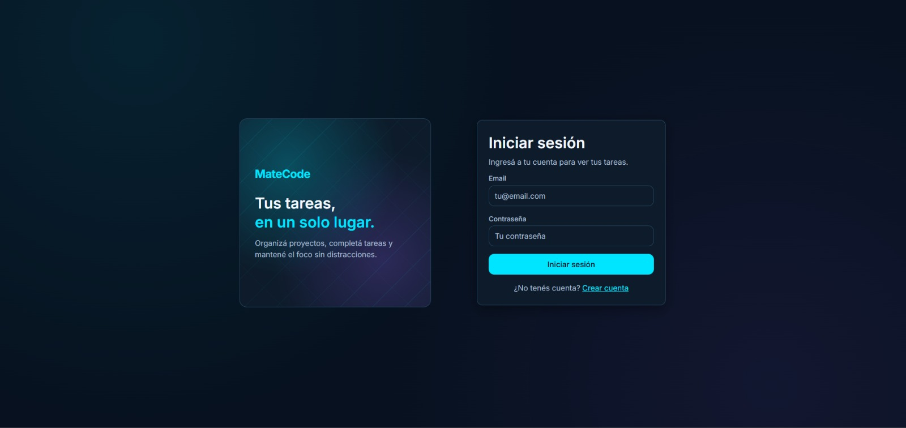
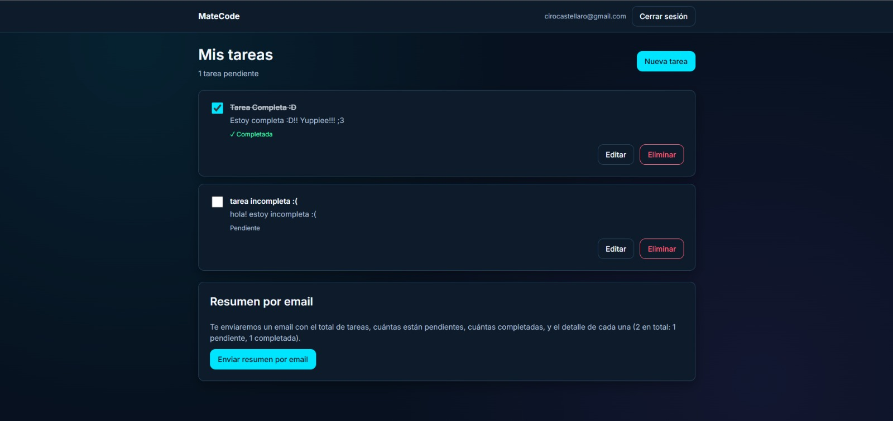
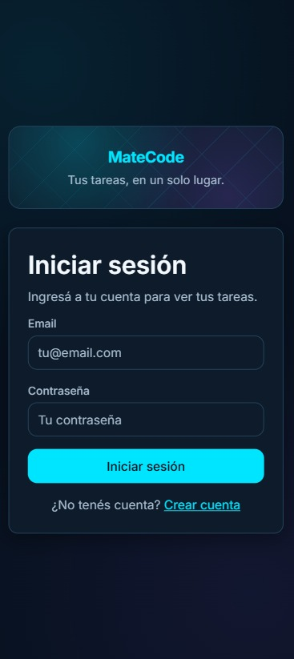
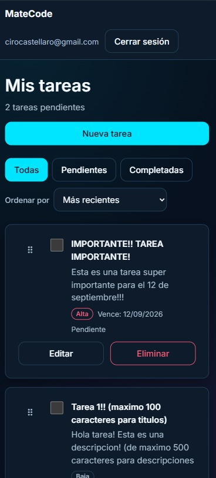
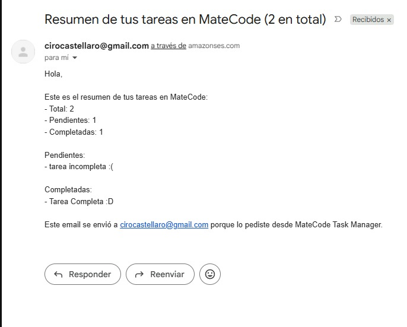

# MateCode | Gestor de tareas

Aplicación web SPA de gestión de tareas para **MateCode**. Permite que empleados gestionen sus
tareas diarias de forma organizada, persistente y accesible desde cualquier dispositivo, con fecha
de vencimiento, prioridad y orden configurable.

- **App deployada:** https://matecode-todo.vercel.app
- **Uso de IA:** https://drive.google.com/drive/folders/1IxxSU3e7-I9HpKwgTkmpk5DwTncvxqY2?usp=sharing

## Tecnologías

- Frontend: React 19.2.8 + TypeScript 6.0.3 (Vite 8.1.5), React Router 7.18.1
- Backend as a Service: Firebase 12.16.0 (Authentication y Cloud Firestore, cliente),
  firebase-admin 13.10.0 (servidor)
- Notificaciones por email: AWS SES (`@aws-sdk/client-ses` 3.1096.0), invocado desde una Vercel
  Function
- Deploy: Vercel
- Testing: Vitest 4.1.10 y React Testing Library 16.3.2

## Instalación

```bash
git clone https://github.com/ciro-castellaro/ProyectoM4-Ciro_Castellaro.git
cd ProyectoM4-Ciro_Castellaro
npm install
cp .env.example .env
```

Completá el `.env` con tus propios valores (ver [Variables de entorno](#variables-de-entorno)).

## Scripts disponibles

| Script               | Descripción                                        |
| -------------------- | -------------------------------------------------- |
| `npm run dev`        | Levanta el servidor de desarrollo (Vite).          |
| `npm run build`      | Type-checks y genera el build de producción.       |
| `npm run preview`    | Sirve localmente el build de producción.           |
| `npm run lint`       | Corre el linter (`oxlint`).                        |
| `npm run test`       | Corre la suite de tests una sola vez.              |
| `npm run test:watch` | Corre los tests en modo interactivo (watch).       |
| `npm run test:ui`    | Abre la interfaz visual de Vitest en el navegador. |

## Variables de entorno

| Variable                            | Descripción                                                                                        |
| ----------------------------------- | -------------------------------------------------------------------------------------------------- |
| `VITE_FIREBASE_API_KEY`             | Config pública del cliente Firebase (consola de Firebase → Configuración del proyecto → Tus apps). |
| `VITE_FIREBASE_AUTH_DOMAIN`         | Dominio de autenticación del proyecto Firebase.                                                    |
| `VITE_FIREBASE_PROJECT_ID`          | ID del proyecto Firebase.                                                                          |
| `VITE_FIREBASE_STORAGE_BUCKET`      | Bucket de Storage del proyecto Firebase.                                                           |
| `VITE_FIREBASE_MESSAGING_SENDER_ID` | Sender ID de Firebase Cloud Messaging.                                                             |
| `VITE_FIREBASE_APP_ID`              | ID de la app dentro del proyecto Firebase.                                                         |
| `FIREBASE_ADMIN_PROJECT_ID`         | Service account de Firebase (solo servidor), usada por la Vercel Function para verificar sesiones. |
| `FIREBASE_ADMIN_CLIENT_EMAIL`       | Email de la service account (consola de Firebase → Cuentas de servicio).                           |
| `FIREBASE_ADMIN_PRIVATE_KEY`        | Clave privada de la service account. Nunca lleva el prefijo `VITE_`: no debe llegar al cliente.    |
| `SES_REGION`                        | Región de AWS donde está habilitado SES (nombre propio, no `AWS_REGION`: ver nota abajo).          |
| `SES_ACCESS_KEY_ID`                 | Access key de un usuario IAM con permisos mínimos (solo enviar emails vía SES).                    |
| `SES_SECRET_ACCESS_KEY`             | Secret key del mismo usuario IAM. Nunca debe llegar al cliente.                                    |
| `SES_SENDER_EMAIL`                  | Identidad (email) verificada en SES desde la que se envía el resumen.                              |

> Nota: los valores de Firebase de arriba son configuración pública del cliente (quedan visibles
> en el bundle de JS), no secretos de servidor. Se mantienen en `.env` de todos modos como buena
> práctica y para no acoplar el código a un proyecto de Firebase específico. La protección real de
> los datos de cada usuario depende de las Reglas de Seguridad de Firestore, no de ocultar estos
> valores.

> Nota: las variables de SES usan nombres propios (`SES_REGION`, `SES_ACCESS_KEY_ID`,
> `SES_SECRET_ACCESS_KEY`) en vez de los nombres estándar de AWS (`AWS_REGION`,
> `AWS_ACCESS_KEY_ID`, `AWS_SECRET_ACCESS_KEY`) a propósito: las Vercel Functions corren sobre AWS
> Lambda, que ya define esas variables reservadas con las credenciales del rol de ejecución de la
> plataforma. Usar los nombres estándar haría que el SDK de AWS tomara esas credenciales ajenas en
> vez de las de nuestro usuario IAM de SES.

## Arquitectura

```
src/
├─ pages/              # Vistas completas (Login, Register, Tasks)
├─ components/         # Componentes de UI reutilizables (TodoForm, TodoList, ConfirmDialog, etc.)
├─ features/           # Lógica de dominio pura, sin UI ni red (validateAuth, validateTask, buildTaskSummary)
├─ services/           # Integraciones externas (Firebase Auth/Firestore, fetch al endpoint de email)
├─ routes/             # React Router y protección de rutas privadas (ProtectedRoute)
├─ hooks/              # Estado de dominio reutilizable (useAuth, useTasks)
├─ types/              # Contratos de datos compartidos (Result<T>, Task, SendSummaryRequest, ...)
└─ utils/              # Helpers generales

api/                   # Vercel Functions: cada archivo acá es un endpoint público (solo glue HTTP)
server/                # Lógica de servidor compartida (verificar idToken, armar y enviar el email
                        # por SES); vive fuera de api/ para no quedar expuesta como endpoint

tests/                 # Tests unitarios y de componentes, con mocks de Firebase/AWS SES

.env                   # Local, nunca se sube (ver .gitignore)
.env.example           # Plantilla sin secretos, sí se sube
.gitignore             # Excluye .env
README.md              # Este archivo
```

> El plan original agrupaba las Vercel Functions bajo `functions/`, pero Vercel solo reconoce como
> endpoint lo que está en `api/` — por eso ese directorio se mantiene deliberadamente delgado (solo
> valida el método HTTP y orquesta llamadas a `server/`), y toda la lógica compartida se separó a
> `server/` para que Vercel no la trate como una ruta pública más.

Todas las capas usan el mismo tipo `Result<T>` (`{ ok: true; value: T } | { ok: false; error:
string }`) para propagar errores de forma explícita y tipada: el compilador obliga a manejar el
caso de error en cada punto donde se consume un resultado.

## Flujo de emails

1. En `TasksPage`, el usuario hace clic en el botón de enviar resumen (`EmailSummary`).
2. El cliente arma el resumen (`buildTaskSummary`) a partir de las tareas ya cargadas y obtiene un
   `idToken` fresco de Firebase Authentication (`user.getIdToken()`).
3. Se hace un `POST /api/send-summary` con `{ idToken, summary }`.
4. La Vercel Function (`api/send-summary.ts`) delega en `server/`:
   - `verifyIdToken` verifica el token con `firebase-admin` (nunca se confía en un email que venga
     del cliente).
   - `validateSendSummaryRequest` valida la forma del body.
   - `buildEmailContent` arma el asunto y el cuerpo del email.
   - `sendEmailViaSes` lo envía con el SDK de AWS SES, usando **el email del usuario ya verificado
     por Firebase** como destinatario (nunca uno provisto por el cliente), lo que evita que el
     endpoint pueda usarse para mandar mail a direcciones arbitrarias.
5. Cualquier error (token inválido, SES caído, credenciales mal configuradas) se traduce a un
   mensaje genérico y seguro antes de llegar al cliente (`getSesErrorMessage`); el detalle real
   solo queda en los logs del servidor.

**Nota operativa:** mientras la cuenta de AWS SES esté en modo _sandbox_, solo se puede enviar a
direcciones verificadas manualmente en la consola de AWS (_Verified identities_). Para que
cualquier usuario registrado reciba su resumen sin verificación previa, hay que solicitar la
salida del sandbox (_production access_) en la consola de AWS.

## Capturas de Pantalla

**Login (desktop)**



**Mis tareas (desktop)**



**Login (mobile)**



**Mis tareas (mobile)**



**Email de resumen recibido**


